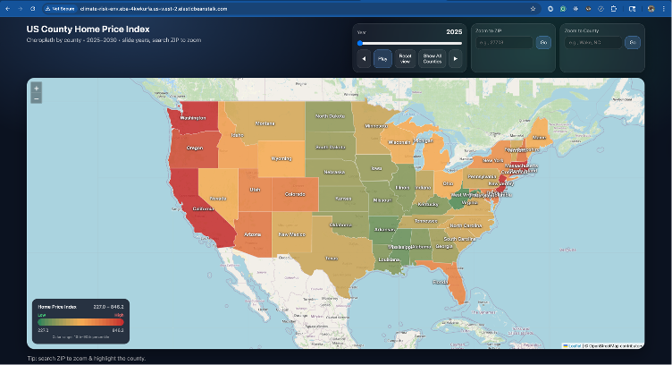
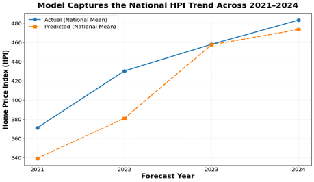
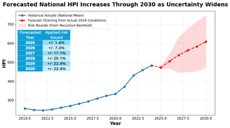
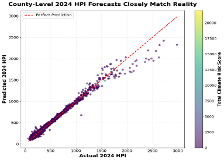

# Monitoring Climate Risk Exposure in Insurance and Home Price Index Markets

This repository contains our 2026 Duke MIDS capstone project developed in collaboration with Citizens Financial Group. The project examines how climate, housing, mortgage, and macroeconomic factors can be used to monitor climate-related exposure in insurance and housing markets, with a focus on forecasting insurance premiums in California and Home Price Index (HPI) trends across U.S. counties.

## Team Members

- Ramil Mammadov  
- Leonard Eshun  
- Jianing Guo  
- Jipu Liu  
- Jay Liu  

## Advisor and Client Partner

**Faculty Advisor:** Professor Alexander Fisher, Department of Statistical Science, Duke University  
**Client Partner:** Mr. Michael Williams and Mr. Shaun DePorter from Citizens Financial Group  

## Project Overview

Climate risk is increasingly affecting housing and insurance markets through rising exposure to hazards such as wildfire, heat, drought, flood, and hurricanes. These risks can influence insurance affordability, mortgage exposure, collateral value, and long-term housing stability.

Our project addresses the question:

**How can banks effectively monitor exposure to the impacts of climate risk on U.S. property and casualty insurance markets?**

To answer this, we developed 2 complementary modeling pipelines:

1. **Insurance Premium Forecasting**  
   A Bayesian hierarchical model to forecast California residential insurance premiums using ZIP-code, county-level, climate, and financial predictors.

2. **Home Price Index Forecasting**  
   An XGBoost machine learning model to predict next-year Home Price Index (HPI) across U.S. counties using historical housing, macroeconomic, mortgage, and climate-risk data.

We also built an **interactive forecast map** to help visualize projected county-level changes in HPI and insurance-related risk from **2025 to 2030**.

*Interactive map showing projected county-level changes in Home Price Index and insurance-related risk from 2025 to 2030.*

## Objectives

- Forecast climate-related insurance premium risk in California
- Predict county-level HPI across the United States
- Evaluate model performance using backtesting
- Translate model outputs into an interactive tool for forward-looking risk monitoring
- Support more proactive assessment of climate-related financial exposure

## Data Sources

Our analysis combines housing, insurance, mortgage, climate, and macroeconomic datasets from multiple public and institutional sources, including:

- Federal Housing Finance Agency (FHFA)
- Federal Emergency Management Agency (FEMA)
- National Oceanic and Atmospheric Administration (NOAA)
- United States Department of Agriculture (USDA)
- California Department of Insurance
- U.S. Census Bureau
- Bureau of Economic Analysis (BEA)
- Home Mortgage Disclosure Act (HMDA) Longitudinal Dataset
- StatsAmerica
- OpenFEMA / NFIP-related sources

## Methodology

### 1. Bayesian Hierarchical Insurance Model

We developed a Bayesian hierarchical model using climate and financial predictors to forecast California homeowners’ insurance premiums.

**Key features:**
- Built on **2018–2020** data
- Covers nearly **2,000 ZIP codes** in California
- Includes ZIP-code and county-level random effects
- Captures both baseline premium differences and county-specific time trends

This approach allowed us to model meaningful geographic heterogeneity while preserving interpretability.

### 2. XGBoost HPI Forecasting Model

We developed a county-level XGBoost model to predict next-year HPI across U.S. counties.

**Model setup:**
- County-year data from **2000–2024**
- Time-ordered split:
  - Train: **2000–2019**
  - Validation: **2020–2022**
  - Test: **2023 inputs → 2024 prediction**
- Inputs include:
  - historical housing indicators
  - macroeconomic factors
  - mortgage-related variables
  - climate-risk indicators

### 3. Backtesting and Forecasting

We used recursive backtesting to evaluate how forecast accuracy changes over longer horizons. This helped us quantify uncertainty and assess how model error compounds as projections extend further into the future.

*Comparison of predicted and actual national HPI trends, showing that the model captured the overall housing trend well.*

*Backtesting results showing that forecast error increases over longer horizons, with widening uncertainty in future projections.*

### 4. Interactive Map

To make the results more practical and accessible, we developed an interactive map for exploring projected county-level housing and insurance-related risk from **2025 to 2030**.

The map helps users:
- identify emerging risk hotspots
- compare county-level changes over time
- monitor how climate and economic conditions may influence future exposure

## Key Results

*Predicted vs. actual county-level Home Price Index values. The XGBoost model achieved strong predictive performance with R² = 0.98.*

- The HPI model achieved strong county-level predictive performance with **R² = 0.98**
- Predicted and actual HPI aligned closely across most states
- The insurance model outperformed non-hierarchical baselines by capturing geographic structure and year-to-year persistence
- The interactive map translated model outputs into a practical tool for planning and risk assessment
- Forecast results suggest continued national HPI growth through **2030**, though later-year projections should be interpreted as baseline forecasts rather than exact point estimates

## Limitations

- The HPI model tends to underpredict high-value counties
- Forecast error increases over longer recursive horizons
- Insurance forecasting is constrained by a short historical window (**2018–2020**)
- Climate variables alone have limited explanatory power in some settings
- There is a trade-off between model interpretability and predictive performance

## Next Steps

- Expand insurance premium coverage beyond California
- Test alternative macroeconomic and climate variables
- Improve performance in expensive housing markets
- Develop scenario-based forecasting beyond baseline assumptions
- Enhance the interactive map with additional functionality
- Explore agentic AI workflows to generate summaries for high-risk areas
